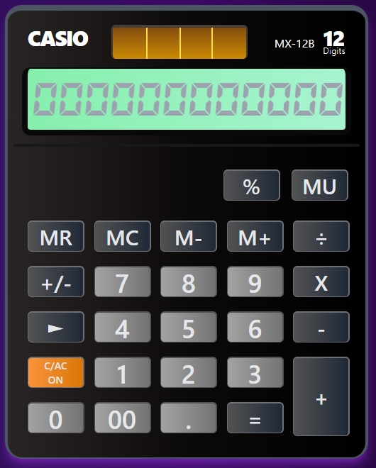

Calculadora

[Enlace Calculadora Casio MX-12B](https://casio-mx12b-reactjs-tailwindcss.netlify.app/ "Enlace")

  

#### Este fue mi primer proyecto que quería probar aprendiendo React, ya que en ese momento aprendí tailwindcss, quería jugar con algo que pudiera darle una forma mas entretenida. Probe creando una copia visual a una calculadora que use mucho tiempo, **la Casio MX-12B**.

#### En la primera parte del proyecto use useState, que fue lo primero que aprendí, después lo cambie a useReducer, sentía que podia controlar mejor los datos.

#### En el componente calculadora en primera parte tenia todo ahí, después de ver tantas clases de tailwindcss mi ojo empezó a tiritar porque se me mezclaba con el código de Js, asi que lo pase a un componente para que quede un poco mas limpia.

#### Hasta ahora solo faltan las funcionalidades de los botones % y MU(este no sé que hace la verdad), el resto esta funcionando.
